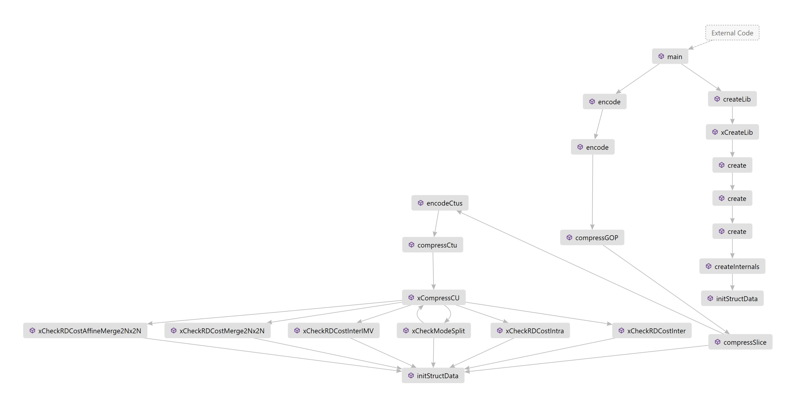

# ROI-based VTM 

This project is a under developed video coding framework that:
- utilizes ROI-based QP settings
- based on VTM (Anchor used: [VTM 18.1](https://vcgit.hhi.fraunhofer.de/jvet/VVCSoftware_VTM/-/tree/VTM-18.1))
- aims to the high level vision tasks.

## Preparation
- A ROI information file should be named `<sequence name>_qp<QP value>_frame<POC>.txt` where:
`<sequence name>` is the sequence name, e.g. BlowingBubbles, KristenAndSara, ... 
`<QP value>` is the base QP value for encoding the sequence
`<POC>` is the current frame's POC
- A ROI information file following this template:
```
    line #1 number of ROIs in the image $n
    line #2 x y width height QP
    line #3 x y width height QP
    ...
    line #n x y width height QP
```

To run this project, a recommended command for encoder is:
```shell
-c ./cfg/encoder_lowdelay_P_vtm.cfg  -c ./cfg/per-sequence/<sequence name>.cfg -i BlowingBubbles_416x240_50.yuv -q 47 -n <sequence name> -r /path/to/ROIinfo/
```

where `-n <sequence name>` and `<-r /path/to/ROIinfo/>` is our definition of name and path to the ROi information, respectively. If we hardcodely set QP for each ROI, an option of `--ROIQP <QP for all ROI>` should be added to the running command.

- More information on how to build and customize the encoding is in [VVCSoftware_VTM GitLab](https://vcgit.hhi.fraunhofer.de/jvet/VVCSoftware_VTM).


## Feature of this version
1: Number of ROIs in an image is set to 20, changeable by replace `20` in `#define MAX_ROIS 20`, file `TypeDef.h`.

~~2: Whenever a CU is created, ROI file is loaded  &rarr; high complexity  &rarr; to define a a ROI information class that read ROI information once at the slice is created.~~

Update: In this version, ROI and its QP have been considered whenever a `CodingStructure` is created. Calling Stack is as follows.




## To do
- [x] Setting QP for each CUs (hardcoded)
- [x] Combining video coding VTM and ROI information
    - [x] ROI class inherit from Area and Position
    - [x] loading ROI information for each video frame once 
    - [x] spread ROI information for the CodingStructure.
    - [x] ROI can be encoded with QP in ROI file or `--QPROI`
- [ ] Either of the following approach should be developed:
    - [ ] Setting QP for each CUs (softcoded)
        - [ ] input a list file of ROIs
        - [ ] Setting QP for each frame
    - [ ] Saliency-based QP settings
- [ ] Encoding ROI information
- [ ] Combining with high level vision tasks. 

